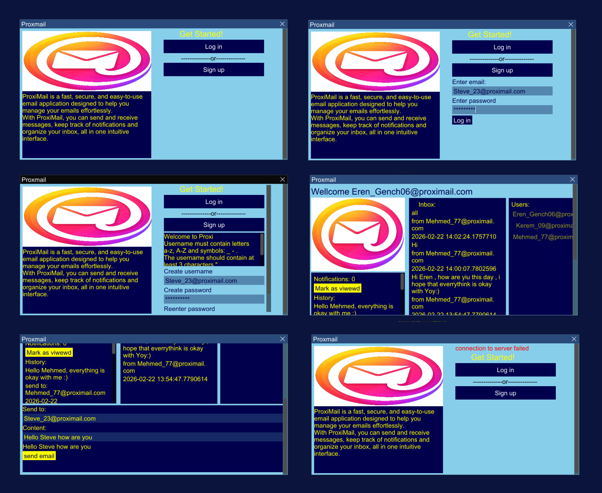

# My-Proximail
Proxmail is a lightweight, cross-platform email client with a simple and modern UI. Messages are received in real time while the application is running, without requiring any manual refresh. User credentials are stored securely, with passwords hashed for protection.



A modern and simple cross platform C++ chat application providing simple UI.

## Table of content

- [Description](#description)
- [Features](#features)
- [License](#license)
- [Installation](#installation)

## Description

This is an email application featuring a clean and simple user interface. Messages are received in real time while the application is running, eliminating the need for manual refresh. User credentials are securely stored, with passwords hashed to ensure privacy.

## Features

- **Cross-device communication**: Users can connect to the chat from multiple devices via server no matter what operating system they are using.
- **GUI with ImGui**: Modern and lightweight interface built with ImGui.
- **Secure user data**: User information is stored in files, with passwords hashed for safety.
- **JSON-based messaging**: Emails are serialized using nlohmann/json (`json.hpp`) for easy storage and transfer.
- **Lightweight and fast**: Minimal dependencies, designed to run efficiently on most systems.

## License
Apache License 2.0

## Installation
1. Clone the repository:

```bash
git https://github.com/ERENGG7/My-Proximail.git